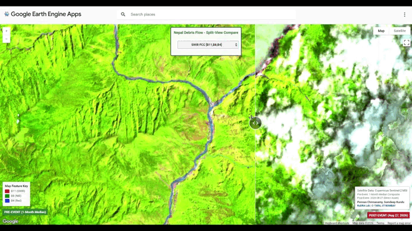

# Nepal Debris Flow Analysis

Downstream exposure, imagery & rainfall anomaly analysis for the Rasuwa River Valley debris flow event (August 25, 2026).

**[View Live App →](https://space-time-somdeep.projects.earthengine.app/view/nepal-debris-flow-downstream-exposure--rainfall-anomaly)**

## Overview

This Google Earth Engine application analyzes the downstream impact of the debris flow event in the Rasuwa River Valley through:

- **Satellite Imagery**: Compares pre-event and post-event Sentinel-2 imagery
- **Hydrological Tracing**: Traces the downstream river network using RiverATLAS data
- **Building Exposure**: Identifies structures in the debris flow corridor
- **Rainfall Analysis**: Visualizes CHIRPS rainfall patterns and anomalies

## Data Sources

- **Imagery**: Copernicus Sentinel-2 MSI (S2_SR_HARMONIZED)
- **Cloud Mask**: Google Cloud Score+ 
- **Hydrology**: HydroATLAS RiverATLAS v10 & HydroBASINS
- **Terrain**: JAXA ALOS AW3D30 v4.1
- **Buildings**: VIDA combined (Google + Microsoft)
- **Rainfall**: UCSB-CHG CHIRPS Pentad

## Author

**Somdeep Kundu**  
RuDRA Lab · C-TARA, IIT Bombay  
somdeep@iitb.ac.in
